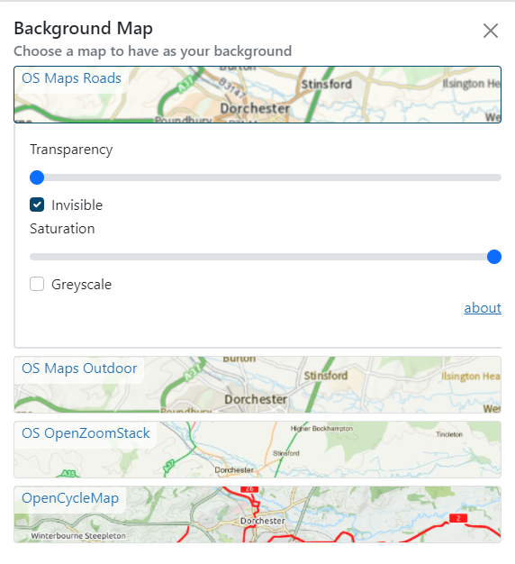

# Background maps

Background map settings can be accessed with the 'Background Map' button on the right.

In this panel, you'll be able to change the background map (sometimes referred to as a basemap) and set its transparency and saturation.

You can switch background maps simply by clicking on the relevant tile. A set of options appear underneath each background map allowing you to change its transparency (how see-through the map is) and saturation (how strong the colour is). 

!!! note
    Some versions of DorsetExplorer may contain different background map options than what is displayed in the image above.
