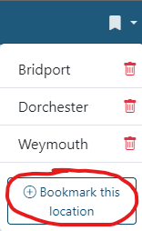
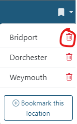

# Bookmarks

!!! warning
    This feature is only available if you are logged in

Bookmarks allow you to save a location to go back to at any time. 

## Creating bookmarks
To create a bookmark of your current location, just click the bookmarks menu in the header, and click 'Bookmark this location'.

You will be prompted to enter a name for your bookmark. The name must be unique and a maximum of 50 characters.

!!! note
    Bookmarks do not include the layers/basemaps you have switched on, rotation or annotations, they are just a centre point and a zoom

## Using bookmarks

To go to a bookmark, simply open the bookmark menu and click the name of the bookmark you want. Your map will be recentred on your bookmark. If the bookmark you clicked is outside of the bounds of the current basemap, such as if you clicked a bookmark you created in Norway but you have the UK OS base mapping on, you will not be able to go to the bookmark and will be warned.

To delete a bookmark, just hit the bin icon next to your bookmark and confirm in the dialog box that pops up.

You can't rename bookmarks, so the easiest thing to do is delete it and add it again with your new name.
