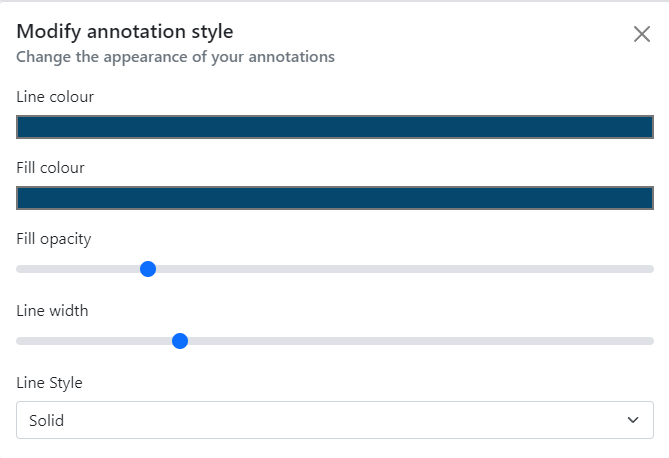
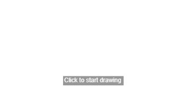
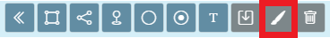
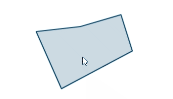

# Drawing on the map

You can draw annotations on the map using the 'Draw' button on the left hand side of the map.

Click this button and a menu will pop open.

## Drawing tools

You can draw the following features onto the map:

* polygons (shapes)
* lines
* points with various symbols
* circles
* text 

When drawing polygons, lines and circles; if you make a mistake you can press the <kbd>Esc</kbd> key on your keyboard to cancel drawing. For polygons and lines, you can press <kbd>CTRL</kbd> (or <kbd>CMD</kbd> on a Mac) + <kbd>Z</kbd> to undo the individual nodes you've drawn.

### Draw a polygon

Click the polygon drawing button to turn it on.

Your cursor will turn into a crosshair (if you are on a computer). A panel will pop out of the side with options on how to style your feature. 

You can choose to set the style of your drawing before you draw it, or you can change it afterwards (see 'Editing your drawings' below).

Click on the map to start drawing, then click once for each point of your polygon. You can either double click or right click to finish your drawing.

When you are done you can click the drawing tool icon again to turn it off.

### Draw a line

Click the line drawing button to turn it on.

Click on the map to start drawing, then click once for each point of your line. You can either double click or right click to finish your drawing.

When you are done you can click the drawing tool icon again to turn it off.

### Add a point

Click the add point button to turn it on.

A default pin will appear under your mouse cursor. Click anywhere on the map to place the pin there. Use the modify annotation panel to choose a different style, colour or size for your points.

When you are done you can click the drawing tool icon again to turn it off.

### Draw a circle

Click the circle drawing button to turn it on.

Click once where you want the centre or your circle to be, then move your mouse outward from that centre point. Move it until you are happy with the size, the click again to finish the circle.

When you are done you can click the drawing tool icon again to turn it off.

### Add text

Click the add text tool to turn it on.

This works a little different from the others. Before you can add text to the map, you need to type your text in to the modify annotation panel.

Once you've done that, you can click on the map to add the text.

!!! tip "Pro tip!"
    You can also use emojis in your text by bringing up your device's emoji keyboard. On Windows you can do this by holding the <kbd>Windows</kbd> key and pressing the period <kbd>.</kbd> key. On a Mac, this is <kbd>CTRL</kbd> + <kbd>CMD</kbd> + <kbd>SPACE</kbd>. This gives you the full range of emojis which you can use as alternatives to our simple icon shapes, or to add a bit of pizazz to your text. Please note that emojis show up differently depending on your device, and we can't guarantee how they will look when exported or printed.

When you are done you can click the add text tool icon again to turn it off.

## Editing your drawings

You can edit your drawings super easily using the Edit button. Click the button to turn it on.

Then click any of your drawings (note this will not allow you to edit measurements or any other layers, just your drawings) and it will be highlighted.

You can edit lines, polygons and circles by hovering over the edges and clicking and dragging. For points and text, just drag from the middle of the point and drop in its new location.

You'll also notice that the styling bar should have popped out. Whilst you are editing a feature, you can change its style and it will be immediately reflected on the map.

## Exporting your drawings

You can export your drawings to a number of common geographic file formats for use in other applications or for sharing with others.

You'll be asked to give your file a name and choose a format:

- GeoJSON - a small and simple format that can handle all geometries apart from Text. Styles are not preserved
- GPX - good if you want to load a route on to a GPS device. Only supports Point and Line geometries. Styles are not preserved
- KML - particularly good for using in Google Earth or if you need text label support. Some styling is preserved but support is limited

## Deleting your drawings

You can delete all your drawings by using the delete icon on the annotations toolbar.

Alternatively, you can delete individual annotations by clicking on it (without any tools turned on) and clicking the 'Remove annotation' link that appears in the popup.
