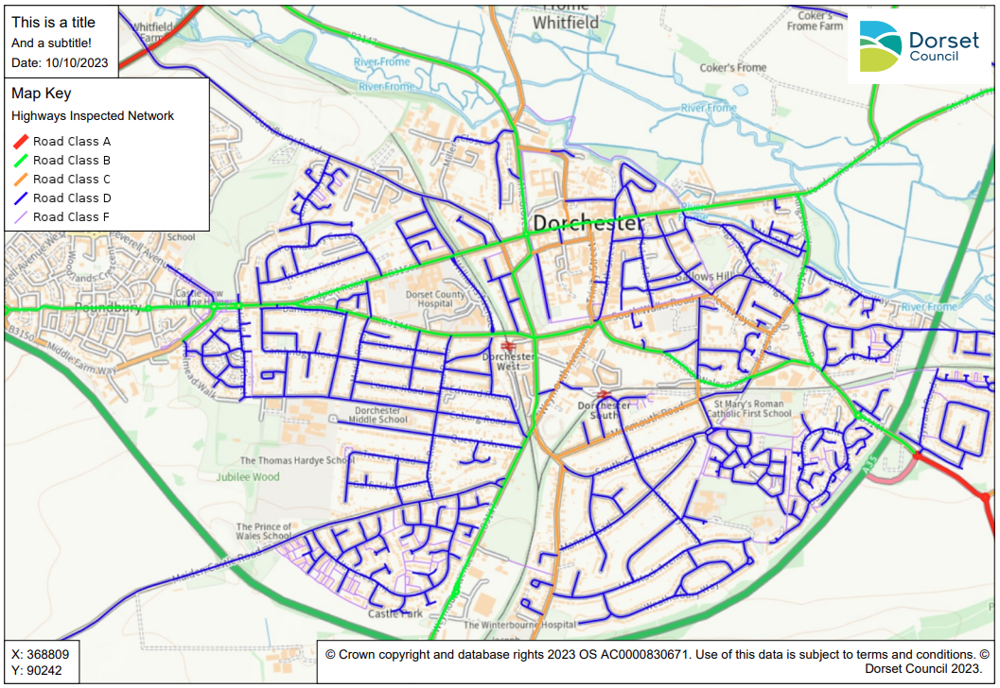
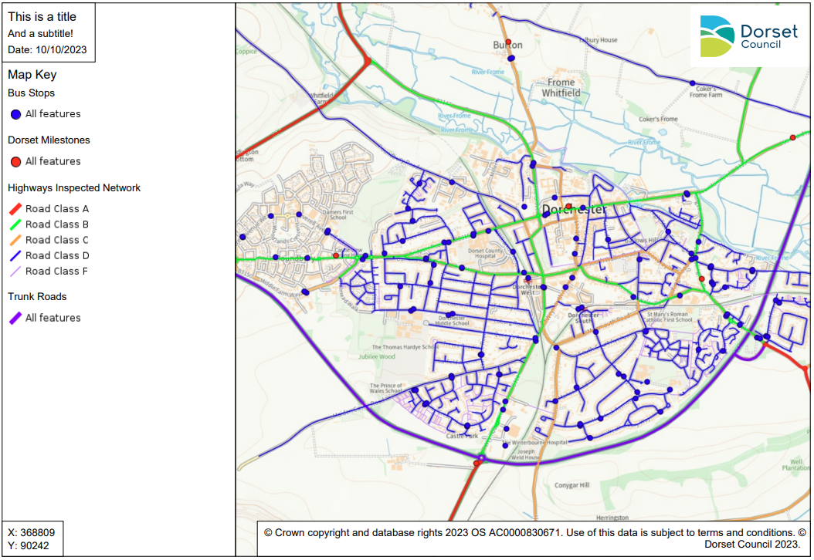
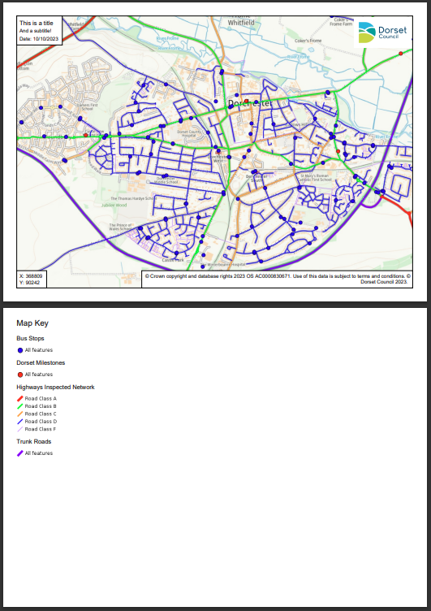

# Exporting and printing

You can export your map to PDF for printing, sending to other people, or embedding in documents. Click on the 'Export/Print' button on the right.

## Exporting to PDF

In the Export and Print panel, you can choose the [page size and orientation](#page-size) you want, what level of [quality](#quality) you need and, optionally, add a [title and subtitle](#titlesubtitle) to your map. You can also choose to add a [legend](#legend).

Once you're done, click Export to PDF. Your map will go dark whilst your PDF is being created and you may see it 'jumping around' in the background. Don't worry, this is normal! Once done your map should automatically download.

### Title/subtitle

These are optional. If you choose to add a title and/or subtitle, it will appear in the top left hand corner of your PDF, along with the date. The maximum length of your title/subtitle depends on the page size and orientation you choose. You will be warned if your title or subtitle is too long for the page size you selected.

### Page size

Choose your output page size and orientation. You can choose Landscape or Portrait for sizes A5 to A2. If you need to produce bigger output, we would recommend you use a professional desktop Geographical Information System (GIS) program as this will have more options and better quality that what we can provide with DorsetExplorer. Get in touch with us to find out more.

### Quality

You can change the quality of the output that is produced. Your options are:

* 96 dpi (low, fast) - fairly low quality but very quick to produce - might be suitable if you're embedding in a document or have lots of layers on and find your maps are taking too long to export to PDF
* 150 dpi (okay) - reasonable mix of quality and speed, ideal if you just need a simple map
* 200 dpi (good) - this is the default and gives you a good quality map that will look good printed and on screen
* 300 dpi (excellent, slow) - the best quality we provide and most suited to printed output - can be quite slow to create the PDF, especially at larger sizes

Note that your output may not look exactly the same as what you see on screen, depending on the quality option you choose. For example, if you choose a high quality output, your base mapping may be at a different scale and look different in the PDF output. This is to make sure you get the best detail mapping at the quality you request.

### Legend

You can add a legend (or 'key') to your PDF to show what the overlays mean. There are 3 placement options. If your legend won't fit, either because its too wide or too tall, it will automatically be placed on a separate page.

#### Floating - Left

This option will place a box floating over the top of your map starting in the top left underneath your title. This is a good option for small legends where the key won't take up much of the map, but be aware that larger keys may cover important parts of the map you want to see. If this is the case, you should use the Pinned option. This option is not available for A5 or A4 Portrait prints.

#### Pinned - Left

This option will create a full height section to the left of the map dedicated to the legend, with the map made smaller to fit fully in the remaining space. This is a good option if your legends is quite large, and it makes sure that the map area you wanted is completely visible. This option is not available for A5 or A4 Portrait prints.

#### Separate page

This option will put the legend on a separate page altogether, leaving your map on its own page. This option is ideal if you want the maximum map size and are happy to have your legend separate. This is the only option available for A5 and A4 Portrait prints.

