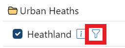
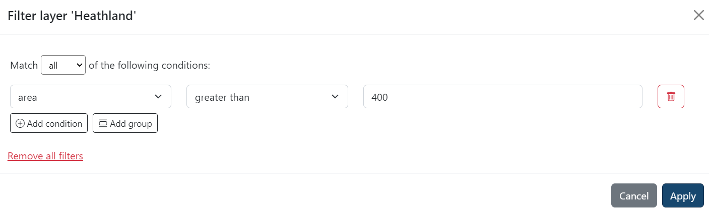

# Filtering

Filtering is really useful when you want to see only specific bits from a layer on the map.

!!! note
    Not all layers support filtering.

## Using the filters

In the layer panel, you can access filters by selecting the filter icon next to each layer. Filters are set for each individual layer and can be as simple or complex as you need. When a filter is switched on, the filter icon will turn solid.

When you select the filter icon, a window will pop-up and give you various options to set up your filter. The options will change depending on the layer. In the example below, we're setting up a filter to show only heathlands that are greater than 400 square meters in size.

You can add additional filters by using the Add Condition button. You can delete individual filters by using the dustbin icon next to each filter, or use the Remove All Filters button to remove them all at once.

When you select Apply, your filters will be applied to the map. You can return to your filters and edit them as many times as you want by selecting the filter icon again.

