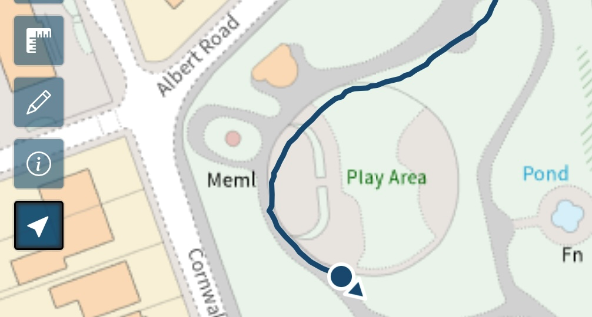
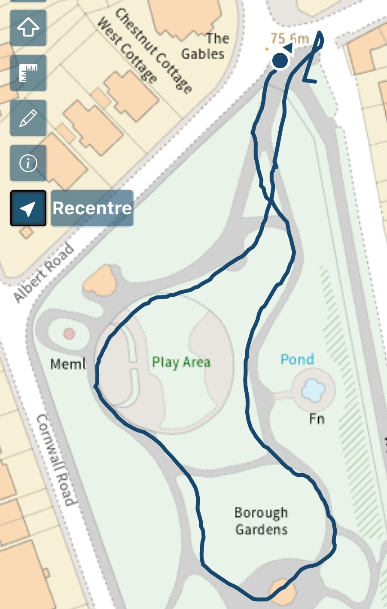
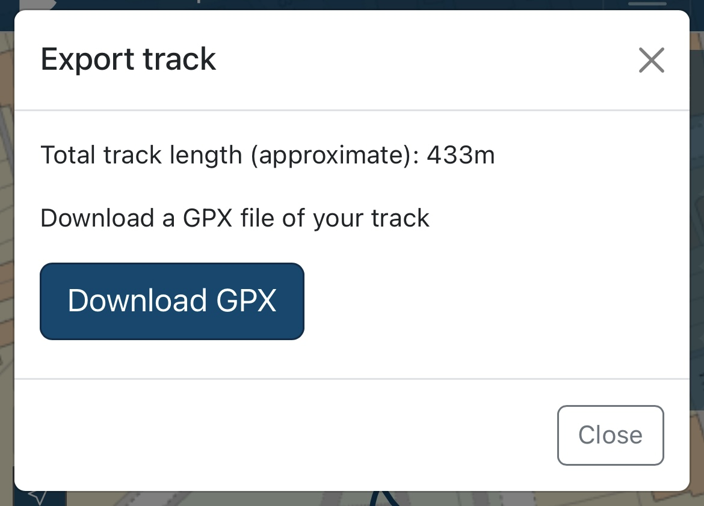

# Geolocation

You can use geolocation to track you, draw your route and download it as a GPX file to use in other applications.

When you select the geolocation button, you have some options to choose. If you're using your mobile phone you can choose to keep your screen awake as you're making your route (this may not work on some browsers). You can also choose if you want your route to draw on the map to be downloadable and how accurate you want the tracking to be.

When you are ready to begin, hit the start tracking button.

The map will zoom to your location and start drawing your route as you move.

{: style="height:250px"}

When you have finished your route, select the geolocation button again to stop tracking.

{: style="height:450px"}

You will be able to download your route as a GPX file to use in other applications.

{: style="height:300px"}