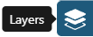
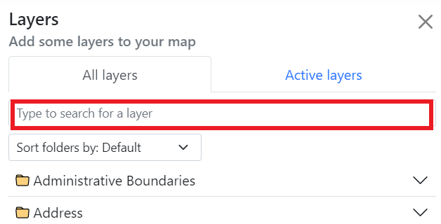
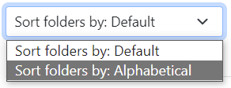
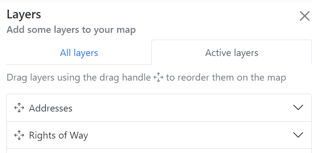
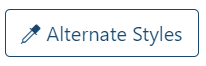
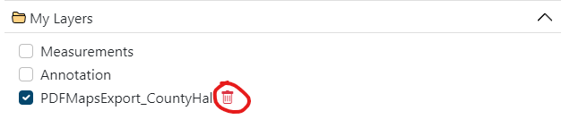

# Layers

Layers are how you can look at various pieces of information and layer them over the top of the map.

All the layers that are available in your version of DorsetExplorer can be accessed with the 'Layers' button on the right.

In this panel you can find layers, switch them on and off, filter them and change how they look.

Layers are organised into folders (and sometimes sub folders) around a general theme. Click a folder to open it and see the layers (or folders) underneath. Click a layer to turn it on and off.

## Searching

You can search for a layer in the list simply by typing in the search box at the top

As you type, the list below will filter and show you matching results. If you are struggling to find what you're looking for, check your spelling, try a different name or get in touch with us.

You can even sort the layer folders in alphabetical order by going to the drop-down box and choosing to sort them alphabeticaly.

## The Active layers tab

The 'Active layers' tab shows all layers you currently have switched on, and lets you reorder and restyle them.

Drag the layers up and down to reorder them on the map. 

You can also click each layer name to open a panel with options to change the transparency (how see-through the layer is) and saturation of the layer (how strong the colour is).

Some layers will even let you change their default styles. Click on the 'Alternative styles' button to see what other styles are available for each layer (some layers will not have any alternative styles). For example, if you don't like the default red and blue triangles we use in the Addresses layer, you can choose alternative shapes and colours.

## Other tools
There are some additional buttons at the bottom of the layers list to help you out.

### Turn off all
This button turns off all the layers that are currently turned on. 

### Show legend
Shows the legend (or key) for any layers you have switched on.

### Add layer
Allows you to add a new layer to the map from a local file or external service.

#### Adding a layer from your device

You can upload certain layers directly from your device to display them on DorsetExplorer.

The file types you can upload are: KML, GPX, GeoJSON, TopoJSON or IGC. Click 'Add layer' then 'Upload data' and follow the on screen instructions, or you can drag and drop your file directly on to the map.

All data is processed in your browser and nothing is sent to us. There is a filesize limit of 50MB.

Larger layers may take time to process. A notification will appear at the bottom once your file has been processed, along with a link to view the entire extent of your newly added layer. If some or all features of your layer fall outside the max extent of the map (for example, if you have an Ordnance Survey base layer turned on, but your layer has features that are in France) you will be shown a warning, but the layer will still be added.

Your layer will be added to the 'My Layers' folder in the Layers panel. You can control the ordering, saturation and transparency just like any other layer by using the 'Active layers' tab. To remove your layer from the map completely, click on the bin icon next to the layer name.

#### Adding a layer from a web service

You can also add layers from external or in house WMS services. These allow you to augment your map with additional data that we have not provided in the layers panel by default.

Click the 'Add a web layer' button and you'll be presented with a list of services to choose from. This will contain a mix of in-house Dorset Council services and external services from the likes of the British Geological Survey, Environment Agency and others. 

!!! warning

    This is a curated list of services we think you might be interested in, but please bear in mind that non Dorset Council services are provided as is from the data provider, and we are not responsible for their content.

Choose a service from the list and hit 'Connect' to view all the layers the service advertises. Where the service has provided a description, we have included that too.

Find a layer you like the look of and click 'Add to map' to add the layer to your map. The layer will be added to the 'My Layers' category in the layer control and a notification will appear with an option to zoom to the extent of the layer. Clicking 'Zoom to Extent' will zoom you to the total extent of the layer, which could be a very large area. Some layers will not display at certain zoom levels, so you may need to zoom back in to see the layer. We cannot control this.

!!! warning
    Layers added from external services may not have certain functionality, such as info clicking, alternate styles or filtering.

 You can control the ordering, saturation and transparency just like any other layer by using the 'Active layers' tab. To remove your layer from the map completely, click on the bin icon next to the layer name.

