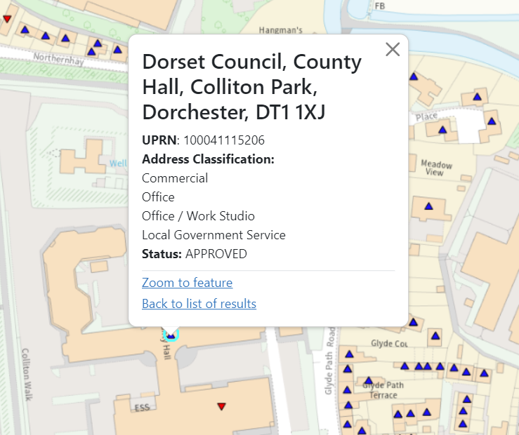

# Getting information from the map

When you've turned on a few layers, features appear all over your map. Finding out more information about these features is really simple, and you can even select a whole area on the map and see which features are listed within it.

## Click directly on the features you want to know about

Click on any feature on the map to find out more about it. For example, if you have the addresses layer on, you can find out the full address for the property you've clicked on, as well as the type of building.

Another example is rights of way, you can click on a footpath and find out how long it is.

If there are multiple items in a feature you've clicked on (for example, a block of flats or an intersection of paths), they will all appear on the list that pops up - scroll to find the item you're interested in and click on it to get further details.

## Using the query tools

As well as clicking on individual features, you can also use our query tools to find out about items in an area that you define. To use the tools, click on the 'i' button on the left side of your screen to get started. The default tool selected is the feature click tool, which is the one we used in the last step.

 

### Find information on features in a selected area

The polygon tool allows you to click on multiple points to create a shape, and will return information about any feature contained within. 

### Find information on features within a chosen distance

The buffer circle tool allows you to set a centre point, and then choose a buffer distance around it (you can choose metres, kilometres or miles).

### Remove selected areas from the map
Shapes you've drawn on the map will stay there until you choose to remove them. To do this, click on any of the shapes you've drawn, and you'll get some options:

* 'Search again using this polygon' - will bring back information about anything within the shape (useful tip: you can turn layers on or off after drawing your shape, and this will bring back results for any layer currently switched on)
* 'Remove query polygon' - will remove this particular shape
* 'Remove all query polygons' - will remove every shape you've drawn
* 'Zoom to feature' - will move your map and centre the shape you've clicked on