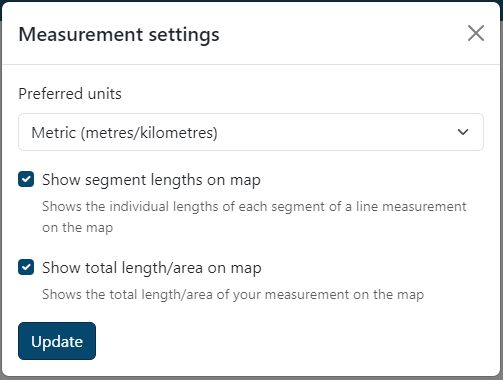
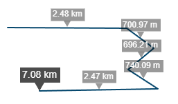

# Measuring

You can measure areas and lines by using the measure tools available on the left hand side of the map.

Click the measure button and a menu will pop open.

When measuring, if you make a mistake you can press the <kbd>Esc</kbd> key on your keyboard to cancel, or you can press <kbd>CTRL</kbd> (or <kbd>CMD</kbd> on a Mac) + <kbd>Z</kbd> to undo the individual nodes you've drawn.

## Measure areas

Click the area measure button to turn on the area measurement tool.

Click your starting point, and then continue clicking to draw your area. Double click or right click to finish your area. The area measurement is displayed on the area, and you can also click the area you drew to bring up a popup with the imperial measurement.

## Measure lines

Click the line measure button to turn on the line measurement tool.

Click your starting point, and then continue clicking to draw your line. Double click or right click to finish your line. The total line measurement is shown at the end of the line, and the individual segment lengths are also shown. You can also click the line you drew to bring up a popup with the imperial measurement.

## Editing your measurements

You can edit your measurements after you've drawn them by turning on either of the measurement tools (as described above). When you hover close to the edge of one of your measurements your mouse will snap to it and display 'Drag to modify'. Click and drag to edit the measurement, the measurement result will be updated as you make changes.

## Removing your measurements

You can delete your measurements by clicking on any of your existing measurements and clicking the 'Remove measurement' option (to remove just the measurement you clicked) 

You can also use the delete measure button to remove all your measurements from the map.

## Configuring your measurements

You can customise your measurements by clicking the Cog :material-cog: icon.

This will bring up a dialog giving you options on what unit of measurement you want to use, and whether to show segment and total lengths on the map

### Preferred units
You can choose between Metric and Imperial units for your measurements. You can always get both measurements by clicking the line or area, this just controls what you see on the map when you draw.

| Measurement type | Metric units                               | Imperial units      |
| ---------------- | ------------------------------------------ | ------------------- |
| Area             | Square Metres, Hectares, Square Kilometres | Square Yards, Acres |
| Line             | Metres, Kilometres                         | Yards, Miles        |

### Show segment lengths on map
You can show or hide the segment lengths that appear on line measurements on the map to reduce the on screen clutter.

<figure markdown="span">

  <figcaption>Measurements with segment lengths ON</figcaption>
</figure>

<figure markdown="span">

  <figcaption>Measurements with segment lengths OFF</figcaption>
</figure>

### Show total length/area on map

You can show or hide the total length or area label that appears on the map on your measurement. If you choose to have this turned off, a popup will appear when you finish measuring showing you the total length/area.