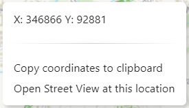

# The right click menu

Right clicking on the map (or long-tapping if you are on a touch screen) opens up the context menu, with the following options.

## Copying Coordinates

The context menu will show the coordinates at the location you clicked in the same coordinate system as shown in the bottom left. You can click the 'Copy coordinate to clipboard' button to copy the coordinates (in a simplified comma separated format) for pasting into other documents or applications.

## Google Street View

If there is Google Street View imagery available at the location you clicked, a 'Open Street View at this location' link will appear, which will open Google Street View in a new window at that location. If you see 'No Street View at this location', then there is no imagery where you clicked, so you may need to right click somewhere else or zoom closer to get a more accurate click.

