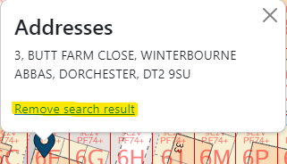

# Finding places
DorsetExplorer has a powerful built in search to help you find any place on the map. The search appears in the top left of the map.

## Basic searching
You can search for many different things including:

* addresses for Dorset and the surrounding areas (using postcodes or partial addresses)
* UPRNs (Unique Property Reference Number)
* village and town names
* roads in Dorset
* place names 
* British National Grid coordinates (12 figure or alphanumeric)
* latitude/longitude coordinates (decimal or degrees/minutes/seconds)
* What3Words identifiers
* Plus Codes

!!! note
    In some versions of DorsetExplorer, some of these options will not be available, or more options will be available.

## Search results
Once you get some results, you can click any of them to be zoomed straight there.

In some cases, we will draw on the map to show you exactly where the result of your search is, either with a marker, a line or a polygon. You can get rid of these by clicking on it and choosing 'Remove search result'.

## Advanced - customising your search
What you search for can be customised by clicking the cog icon next to the search button. 

This will bring up a list showing you all the available searches and what order they are performed in. You can then choose to turn certain searches off and on by toggling the 'Enabled' checkbox.

You can also choose how DorsetExplorer behaves when it finds a result. When you do a search, DorsetExplorer starts from the top of the list and works its way down until it finds a result. When it does, if the 'Stop if found' checkbox is checked, DorsetExplorer will not continue with any of the other searches. This prevents you from getting lots of potentially irrelevant results when a more relevant result has already been found. You can change this behaviour by toggling the 'Stop if found' checkboxes.

!!! note
    By default, only one search result you click is shown on the map at once. You can change this so the search results remain on the map by checking the 'Allow multiple search results on map at once' checkbox
