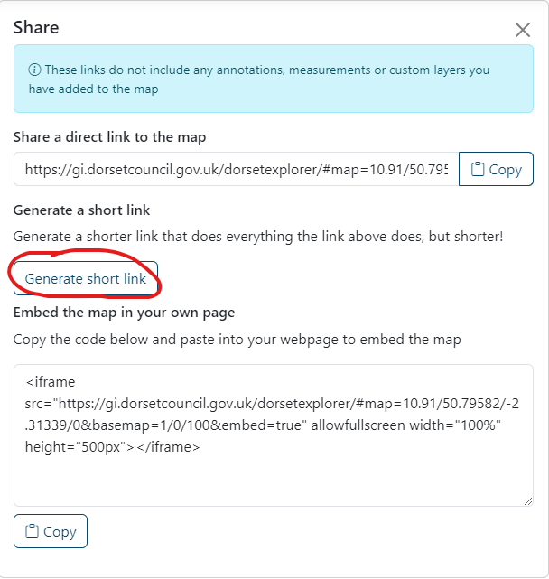
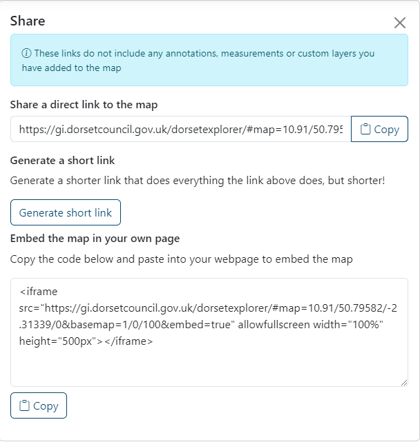

# Sharing your map
You can share links to custom maps you've made, which could include:

* where you are on the map and how zoomed in you are
* which basemap you're using and any changes you have made to it - including opacity and saturation
* the layers you have switched on and any changes you have made to them - including alternative styles

!!! warning
    Any annotations, measurements or custom layers you add will not be included in your map link.

## Share a link
There are two ways you can get a link of your map to share.

The easiest way is to copy and paste the URL in your browser address bar.

Alternatively you can click on the Share icon on the righthand side of the page and copy your link from there.

### Short links
DorsetExplorer share links can be quite long, especially if you have a search result pin or alternative styles applied. You can generate a short link using the 'Generate short link' button. This will generate a link that will do exactly the same as the long link, but much shorter.

## Embed your map on a website
If you want to embed a map on your own website, click on the Share button on the righthand side of the page, and copy the embed code ([find out more about embedding and iframes on the MDN website](https://developer.mozilla.org/en-US/docs/Web/HTML/Element/iframe)).

!!! warning
    Any annotations, measurements or custom layers you add will not be included in your map link.

